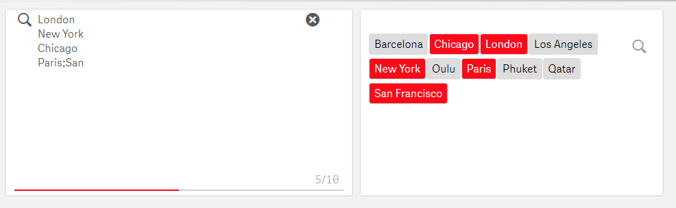

# Qlik Sense extension for field and variable selections with "missing features"

This extension is an "all in one" selection component with several customization options. It gives Qlik Sense many Qlikview features like select only one, default value and context menu.
To reduce amount of required extensions on a sheet Simple Field Select has global options for the current sheet modification. In this way you can hide many settings for example inside the year selector. In addition you can set  background color of the sheet/objects, hide title bar, modify all borders, remove Insights button etc.

If you have a good idea for further development, let us know. Check https://www.oivalo.fi

This extension is tested on Qlik Cloud. For Qlik Cloud installation, please use zip files located in the dist folder.

## To install
Download a ZIP file from the dist directory or clone the branch. Install the zip as any Qlik Sense extension.

**Some of the zip files in dist/ directory have been corrupted so that Qlik cloud setup won't be able to install them. Fixed at least in 2.0.6 zip file. (7-Zip must be used to create package, not Windows zip)**
In some cases browser cache will use old version of settings and requires recently removed javascript file. That file has been added to latest version but is not required anymore and will be later removed.

## Latest features
- **NOTE to Cloud users** There are major changes in Qlik's Cloud environments HTML structures (for example sheet header manipulations). Many features are fixed in 2.1.3 version.
- Option to enable text field sanitization which will "disable" for example Javascript and other HTML control characters from output. This is done on server side by modifying source code and it will then affect to all SFS instances on that server. The idea is to have an option to prevent Qlik developers from injecting Javascript or HTML code
   - To enable: Edit the extension source code inside the zip file. On the 4. line of properties.def.js set value to 1: _var useSanitize = 1;_ Default value is 0. So every time SFS extension is updated, the option must be re-enabled. Value 2 will sanitize only javascript tags.
- Gloabl option to hide only the Story telling -button.
- Finally fix for dragging selection "start issue" - Now the first element also gets selected
- Disable toggle - Finally there is now fix or workaround for "Always one selected value" -problem. If field has this setting on, disabling "Toggle mode" in the extension helps. Disable toggle mode can be of course used for other purposes too.
- Sections to dropdown and select2 visualizations
- Global options to control some visual settings of **all** SFS objects on a sheet, colors, paddings.
- Global option to remove zoom/maximize efect from mobile view. This makes selecting and interacting with graphs and tables so much faster in mobile.
- Search only visualization - will show search box only, won't draw elements. This is usefull for fields with high number of elements and when there is a need to select great amount of them. For example by copy-pasting from Excel etc. Works also with delimited string. Limitation: Won't count duplicates in multiword case correctly while searching.
- Global option for Sheet background extra HTML element - experimental feature to have custom HTML on document background. See ChangeLog for a demo.
- Copy-paste multivalue search can be set into excel mode where you can user either list of values from excel in vertical or horizontal mode.
- Copy-paste multivalue search. You can define separator character for search field so that you can copy-paste multiple values to be searched. For example set separator to ; and type into SFS search box London;Paris;Barcelona;New York;Helsinki and those cities will be selected (Wildcards are not supported.)
- Overlay functionality. Create a canvas on top of selector to prevent selecting.
- Global object settings: Custom CSS style for header and header text. Custom CSS for graph axis texts.
- Possibility to hide elements by their value with defined list of items to be hidden.
- Bug fix: If default value with variable is used it might cause infinite loop and flickering.  Tip: Do not use variable default, set variale value hard coeded instead.
- Bug fix: In a mashup variable values may have not been set correctly with latest Qlik Sense versions
- Fix for search icon. Since latest(s) Qlik Sense versions Full screen icon was overlapping search icon. This is first quick fix for this issue.
- Default colors of Select2 visualization changed to Qlik colors
- Set font and background colors or custom CSS when mouse hovers on an element.

## Features
- supports **select only one** and **default value(s)** selection - so when you enter to a document or a sheet, you can have default value/values selected
  - If you use default values with variables, it's best to set the default value to the variable in the beginning. 
  - Default values can be selected only once.
- has a context menu (right click menu) for _select all_, _clear selections_, _reverse selection_, _select possible_, _select default values_, _copy to clipboard_ and _select randomly_ (Just came to my mind, for fun maybe). You can select which options are shown on the menu.
- will fit on one line - you can disable Qlik Sense default header, paddings, margins and do other tricks to enhance standard visualization
- renders as a list, button row, checkbox, standard radio button or drop down selector.
- custom text fields: label text, tooltip for mouse hovering and help text below the element
- can set variable value from predefined list, HTML5 standard inputs or via **date picker**
  - two variables can be set at the same selection (if you need a value for UI and value for other usage)
  - date picker can limit to min and max date
  - HTML5 input types: range slider, color picker (color input), date, password, number, time, week, month
- mobile zoom effect can be disabled. No need for three clicks if you want to select something. **Only one click is enough!!**
- several posibilities for visual changes like colors, borders etc. Custom CSS classes, HTML attributes can be applied to rendering. In this way you can use for example CSS classes from other libraries to render elements.
  - Show only selected
- supports hiding a field from Qlik Sense's selection row
- supports transparency of the object
- Some of the visualizations allow to use Qlik Sense's Leonard UI styling, for example for drop down select Leonard UI styling works well
- search can be enabled for some of the visualizations
- several color settings like background color for the object itself
- Hide all headers from a sheet + color options for every header
- Qlik Sense styled switch and checkbox
- Select2 plugin has been integrated to the extension. It allows to use a searchable dropdown menu, either normal version or multiselect version.
- custom HTML pre/post every element
- Option to clear selection on sheet enter or leave.
- Responsive and fixed font size options
- Menu icon styled right click menu trigger - if export mode is used, right click menu won't work
- Option to select many values into one variable
- Flexbox layout - same width to all elements
- Custom width and height of element
- Property to set a fixed font size like 10px. Native filters tend to use font-size 12px.
- Resize feature on mouseover
- Copy text to clipboard with context menu (right click menu). It will copy selected or available values to clipboard.
- Option to clear selections of the field on sheet leave / enter. This feature with the clear all option was going to be a customer paid option for this extension but that project failed. :( But here is now this great functionality for free to everyone!
- Add text object to menu bar
- Note! Change to export mode handling in 1.8.6, see change log

## Global sheet level settings
All following global settings are sheet specific. You can use for example master items for one SimpleFieldSelect if you wan't to have the same settings on every sheet.

- Global parameters for a sheet:
  - Modify background color of the sheet and all objects (or objects of type).
  - Change border style for all objects on the sheet.
  - Hide any field(s) from the selection bar.
  - Hide sheet title or modify it's size and font-size
  - Hide selections bar and main menu bar. But be carefull if you remove the main menu, you can access edit mode only by changing the end of the url to /state/edit
  - Hide header from the Text & Image objects. You will get much more space for the text itself! Many times users cannot see the text because of the size of the header in the text object so now you can get rid of it!
  - Hide header from every object on a sheet
  - Reduce header padding in all objects while using Focus theme
  - Font-family and font color can be set for all elements
  - Remove filter boxes from Pivot tables
  - Extra text field to selection bar and header
  - Hide pivot table filter boxes for extra space
  - Hide Smart search, Selections tool and Insights buttons
  - Clear all selections when arriving to sheet and when leaving a sheet
  - Keep Qlik alive -timer. If your Qlik forces you to login after having lunch or unsaved script gets lost during the phone call, here is the keep aliver. :) You can set time for example like if (OSuser()="your username", 5, 0) and you will have this keep alive timer on and others don't. Only one browser tab with this option on is needed to keep Qlik alive.
  - Remove "Data, Analysis, Story"
  - Change selection colors for filter pane and selection bar
  - Global option for native Qlik list object coloring (filter pane) and current selection panel.
  - Global option to set keep alive timer. If your Qlik forces you to login after having lunch or unsaved script gets lost during the phone call, here is the keep aliver. :) You can use for example like if (OSuser()="your username", 5, 0) and you will have this keep alive timer on. Only one browser tab with this option on is needed to keep Qlik alive. 
  - Gloabl option to hide new "Data, Analysis, Story" for Qlik Sense 2019 February release 
  - Global option to **clear all** selections when arriving to sheet and when leaving a sheet. Finally a good implementation to clear selection on sheet arrival. Works well in combination with default value selection. This was a customer requested feature.

This extension is supposed to be very light weight. It has no big libraries attached to it. In this way your Qlik Sense application is able to stay as fast as possible.
** Note: To allow extent modification possibilities in this extension some text fields allow Qlik developer to write Javascript, HTML and CSS and this might cause issues if user written code is broken or does unwanted things. There is now an option which will remove special marks so that Javascript inserted into text fields is not executed.**

### Changelog
[ChangeLog](ChangeLog)

## Screenshots

And context menu for the "missing features":

HTML inputs:

  

For date picker jQuery UI component is used. CSS is parsed for only required parts.
Select2 (select2.org) plugin is used for Select2 dropdown visualization.

Visit https://www.oivalo.fi